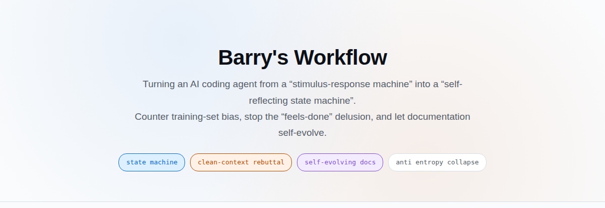
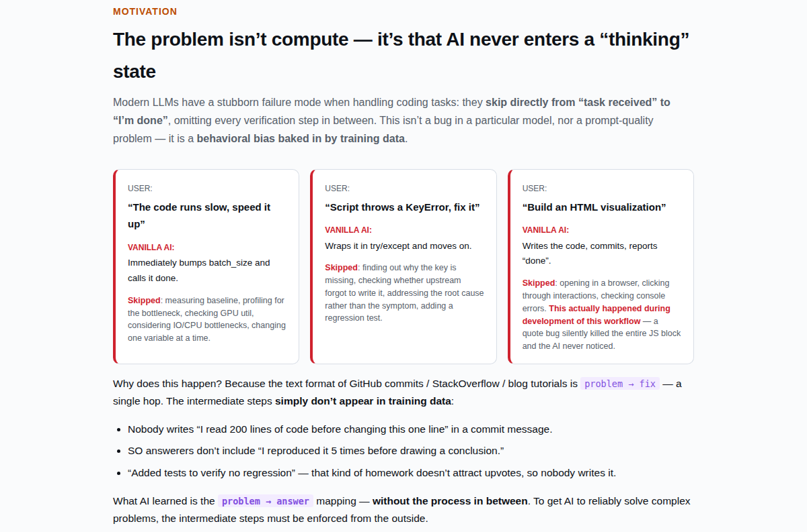
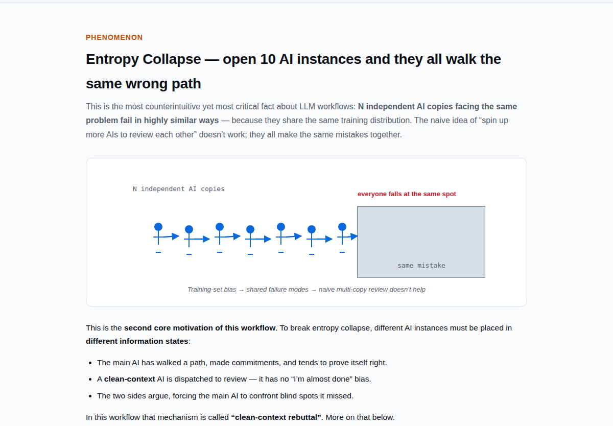
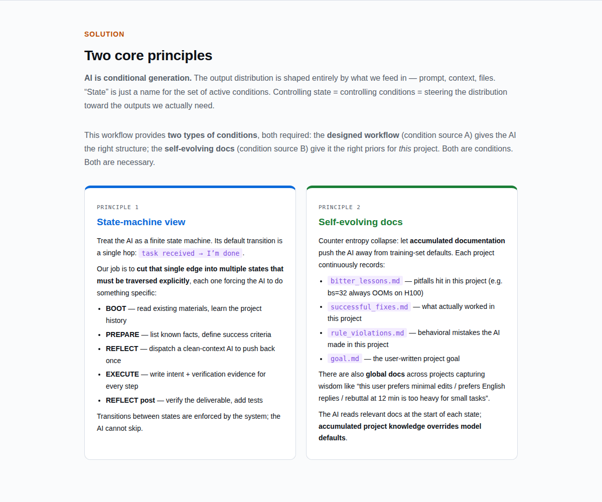
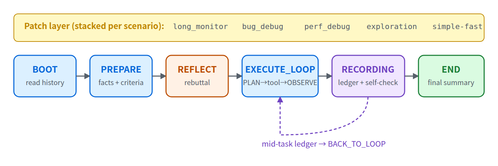
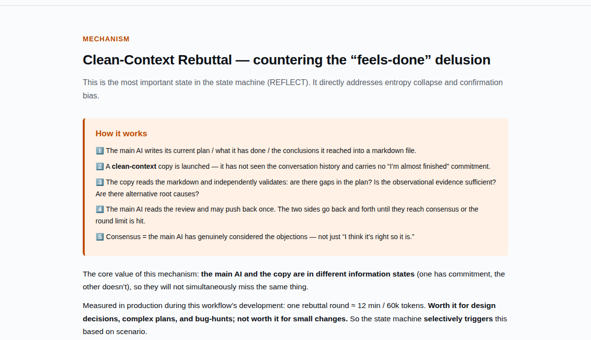

<p align="center">
  
</p>

<h1 align="center">Barry's Workflow — Claude Code Edition</h1>

<p align="center">
  A set of hooks + rule files that constrain every Claude Code session<br/>
  into a five-state Finite State Machine (FSM):<br/>
  BOOT / PREPARE / REFLECT / EXECUTE_LOOP / END.<br/>
  Prevents the model from skipping intermediate steps and delivering "fixed code" without verification.
</p>

<p align="center">
  <a href="README.md"><b>🇨🇳 中文</b></a>
</p>

---

## ⚡ Quickstart

```bash
# 1. Prerequisite
npm install -g @anthropic-ai/claude-code

# 2. Install this repo (idempotent, safe to re-run)
git clone https://github.com/gyy0592/claude-config.git ~/Programs/claude-config
cd ~/Programs/claude-config
bash set_claude.sh

# 3. Use Claude Code normally
cd <your-project>
claude
#    Tell it what you want — it will create workspace/<task_name>/ and draft goal.md
#    for your sign-off. (optional) manual one-time init:
#      bash ~/Programs/claude-config/scripts/new_task.sh <task_name>
#      $EDITOR workspace/<task_name>/goal.md

# 4. Toggle
bash ~/Programs/claude-config/scripts/switch_hooks.sh off      # temporarily disable
bash ~/Programs/claude-config/scripts/switch_hooks.sh on
bash ~/Programs/claude-config/scripts/switch_hooks.sh status
```

Detailed install/uninstall in [§6](#6-installation). Design rationale and mechanism below.

---

## 1. Motivation



Most LLM training samples are "problem → fixed code" pairs, lacking the intermediate diagnose / try / re-test process. The default output distribution thus biases toward producing the end state directly: claiming "fixed" without running tests, scope creep beyond the request, and even when sampled independently multiple times, output paths cluster tightly (the single trajectory closest to the training distribution is hit repeatedly).

Adding "please double check" to the prompt cannot reshape this distribution — instructions themselves are low-weight conditions and get diluted as the conversation grows.

<details>
<summary>🧠 What is entropy collapse</summary>



</details>

---

## 2. Core idea: treat the AI as a conditional generator



The AI's output distribution is fully determined by input conditions (prompt, context files, tool returns). What we call a "state" is just the name of the currently active set of conditions. **Controlling state = controlling conditions = narrowing the distribution to what we actually want.**

This repo supplies two kinds of conditions, both required:

| Condition source | Content | Nature |
|---|---|---|
| **A. Designed workflow** | Five-state FSM rules, per-state injected **router text** (one markdown per state describing allowed/forbidden tools and required outputs, concatenated by a hook in front of every user turn), `[PLAN]` / `[OBSERVE]` logging discipline, and the **rebuttal protocol** in REFLECT (see §3) | Static, human-designed; covers intermediate steps missing from training data |
| **B. Self-evolving docs** | Project-level **ledgers** (append-only numbered markdown files: `bitter_lessons.md` / `successful_fixes.md` / `rule_violations.md`) and `content/rules/patches/*.md` scenario patches | Dynamic, accumulates per project. Each session appends entries; next session's BOOT phase reads them, further narrowing the distribution |

A gives the AI the correct structure; B gives it priors specific to **this project**. Both are injected into every turn's `UserPromptSubmit` context via hooks.

---

## 3. The state machine



```
BOOT ──► PREPARE ──► REFLECT ──► EXECUTE_LOOP ──► END
            ▲                          │
            └──────── anomaly rollback ─┘
```

| State | Allowed tools | Required output | Exit condition |
|---|---|---|---|
| **BOOT** | Read / Glob / Grep / read-only Bash | Read `~/.claude/rules/`, the shared ledgers under `workspace/` (`bitter_lessons` / `successful_fixes` / `attempts_ledger` / `rule_violations`, filtered by `task:`), and `workspace/<task>/goal.md` | `transition.sh BOOT_DONE` |
| **PREPARE** | above + repeated Read (using `state.md`'s `cache_hit_map` to skip re-reads) | Write a `[PLAN]` todo list | `PREPARE_DONE` |
| **REFLECT** | `Agent(run_in_background=true)` | Spawn an independent sub-agent to perform rebuttal | sub-agent writes `[CONSENSUS_REACHED]`; default cap 3 rounds, configurable in `~/.claude/rules/workflow_config.yaml` |
| **EXECUTE_LOOP** | all | one `[PLAN]` line before each tool call, one `[OBSERVE]` line after | `EXECUTE_EXIT`; within the same loop `execute_loop_audit.sh` scans `action.md` for anomaly keywords — 3 rebuttals force rollback to REFLECT |
| **END** | Read / write to workspace only | Append distilled entries from this session to `bitter_lessons.md` / `successful_fixes.md` etc. | session end |

State transitions are **actively** initiated by the model after meeting the exit condition: it calls `bash ~/.claude/hooks/transition.sh <event>`. `transition.sh` is **not** a hook — it's a script the model invokes. It writes `state.md`; on the next `UserPromptSubmit`, `inject_router.sh` reads the new state and injects the corresponding router text.

**Where `<task>` comes from**: the user places `workspace/<task>/goal.md` manually (or has the AI run `scripts/new_task.sh <name>` to scaffold it); on first `UserPromptSubmit`, `session_boot.sh` picks the most recently modified task subdirectory and writes its name to the `task` field of `state.md`. Every subsequent ledger entry carries that `task:` value.

### REFLECT's rebuttal protocol

<details>
<summary>expand</summary>



</details>

The main agent writes its current plan to `.barry_workflow/<sid>/reflection_<round>.md`, then spawns a sub-agent via the `Agent` tool. The sub-agent starts as a **fresh session**: no inherited conversation history from the main agent, and its system prompt is regenerated by hooks (not reused from the main agent). The sub-agent reads only the plan file, the rule files, and the code repo itself. Main and sub append alternating rounds in the same reflection file until the sub-agent writes `[CONSENSUS_REACHED]`, or `reflect.max_rounds` (default 3) is reached.

This counters the self-persuasion bias within a single context — under the same conversation history, the model almost always concludes "the plan is fine."

---

## 4. Scenario patches

Five patches under `content/rules/patches/` override default state behavior for specific task types (hyperparameter tuning, doc migration, perf audit, etc.). Patches can be hand-authored; alternatively, during EXECUTE_LOOP the user runs the `/gen-patch-draft` skill to draft a patch from recurring entries in `bitter_lessons.md` — human review required before it lands under `patches/`. The next session's BOOT phase reads it, closing the loop "concrete pitfall → general constraint."

Patches do **not** auto-activate, avoiding the runaway path where "the AI drafts constraints on itself."

---

## 5. File layout

```
.barry_workflow/<session_id>/        per-session, gitignored by default
  state.md           YAML: current_state / stage_history / task / cache_hit_map
  action.md          [PLAN] / [OBSERVE] step log
  transitions.log    3-line summary per state transition
  reflection_*.md    multi-round rebuttal records

workspace/                           persistent across sessions, recommended for git track
  bitter_lessons.md  repo-shared — technical pitfalls (L-N, each entry has task: + tags:)
  successful_fixes.md repo-shared — verified fixes (FIX-N + task: + tags:)
  attempts_ledger.md  repo-shared — attempt log (ATT-N + task: + tags:)
  rule_violations.md  repo-shared — AI behavioral errors (W-N + task: + tags:)
  <task>/
    goal.md          per-task, user-written, read-only for main agent

~/.claude/rules/                     global rules (cross-project)
  violation.md       global W-XXX (separate namespace from project-level rule_violations.md)
  lessons.md         global L-XXX (separate namespace from project-level bitter_lessons.md)
  router_<STATE>.md  per-state injection text
  states/<state>.md  full per-state spec
  patches/*.md       scenario patches
  workflow_config.yaml  tunables (reflect.max_rounds etc.)
```

`bitter_lessons.md` (repo-shared tech pitfalls) vs `rule_violations.md` (repo-shared AI behavioral errors): the former records facts like "batch size X OOMs on this GPU"; the latter records mistakes like "skipped [PLAN] and called the tool directly." Every entry carries `task: <name>` + `tags:`; new sessions filter by current `task` name OR shared tags during BOOT.

Project-level numbering (`L-N` / `W-N`) and global numbering (`L-XXX` / `W-XXX`) live in **independent namespaces** — no cross-file references.

---

## 6. Installation

```bash
npm install -g @anthropic-ai/claude-code   # prerequisite
git clone https://github.com/gyy0592/claude-config.git ~/Programs/claude-config
cd ~/Programs/claude-config
bash set_claude.sh
```

What `set_claude.sh` does:

1. Copies 8 scripts from `hooks/` to `~/.claude/hooks/`, sed-substituting `__CLAUDE_CONFIG_DIR__` with the actual repo path:
   `inject_router.sh` · `session_boot.sh` · `pretooluse_short_nudge.sh` · `state_enforce.sh` · `transition.sh` · `prepare_helper.sh` · `execute_loop_audit.sh` · `_session_lib.sh` (utility library sourced by the others)
2. Syncs `content/rules/` to `~/.claude/rules/`
3. Registers 4 hook callbacks in the `hooks` field of `~/.claude/settings.json`, across 3 trigger points:
   - `UserPromptSubmit` × 2: `session_boot.sh` + `inject_router.sh`
   - `PreToolUse` × 1: `state_enforce.sh` (includes a `pretooluse_short_nudge` sub-branch)
   - `PostToolUse` × 1: `execute_loop_audit.sh`
4. Diffs existing `violation.md` / `lessons.md` against the repo versions; on conflict, prompts interactively (defaults to repo version under pipe execution)

Idempotent. Upgrade: `git pull && bash set_claude.sh`.

### Toggle and uninstall

```bash
bash scripts/switch_hooks.sh off     # remove hook registrations from settings.json
bash scripts/switch_hooks.sh on
bash scripts/switch_hooks.sh status
```

Full uninstall:

```bash
bash scripts/switch_hooks.sh off
rm ~/.claude/hooks/{inject_router,session_boot,pretooluse_short_nudge,state_enforce,transition,prepare_helper,execute_loop_audit,_session_lib}.sh
rm -rf ~/.claude/rules/{router*.md,states,patches,messages}
rm ~/.claude/rules/{facts_first,dispatch,recording,subagent_rules,failure_stop,fsm,prompt_enhancement,codex_adapter}.md
rm ~/.claude/rules/workflow_config.yaml
```

`violation.md` / `lessons.md` / `~/.claude/skills/` are preserved as user long-term assets.

---

## 7. Skills

`skills/` contains 30+ standalone skills (censor / code-tree / efficiency-audit, etc.) auto-invoked by Claude Code via each `SKILL.md`'s frontmatter `description`. Orthogonal to the hook system above; install independently:

```bash
mkdir -p ~/.claude/skills
for s in ~/Programs/claude-config/skills/*/; do
  ln -sfn "$s" ~/.claude/skills/$(basename "$s")
done
```

Catalog: [`docs/skills.md`](docs/skills.md) / [`docs/skills.zh.md`](docs/skills.zh.md).

---

## 8. Viewer

`viewer/` is a local HTML three-pane session inspector (left: agent tree; top-right: state and reflection; bottom-right: cleaned transcript).

```bash
bash scripts/start_viewer.sh           # auto-picks a port and prints the URL
bash scripts/start_viewer.sh status
bash scripts/start_viewer.sh stop
```

For SSH-remote use: `ssh -L <port>:localhost:<port> user@host`. A sample session ships under `viewer/data/sample/`; place your own session data at `viewer/data/<sid>/`.

---

## 9. Further reading

| Doc | Content |
|---|---|
| [`docs/skills.md`](docs/skills.md) / [`docs/skills.zh.md`](docs/skills.zh.md) | Skill catalog and trigger conditions |

`docs/` also contains a few HTML files (illustrated motivation; expected behavior for typical scenarios). GitHub does not render HTML; clone and open them locally in a browser.

---

<p align="center"><i>Maintained by <a href="https://github.com/gyy0592/claude-config">@gyy0592</a>. Issues and PRs welcome.</i></p>
