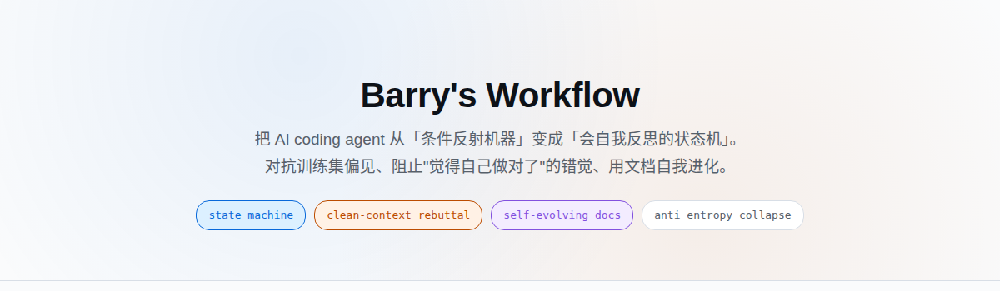
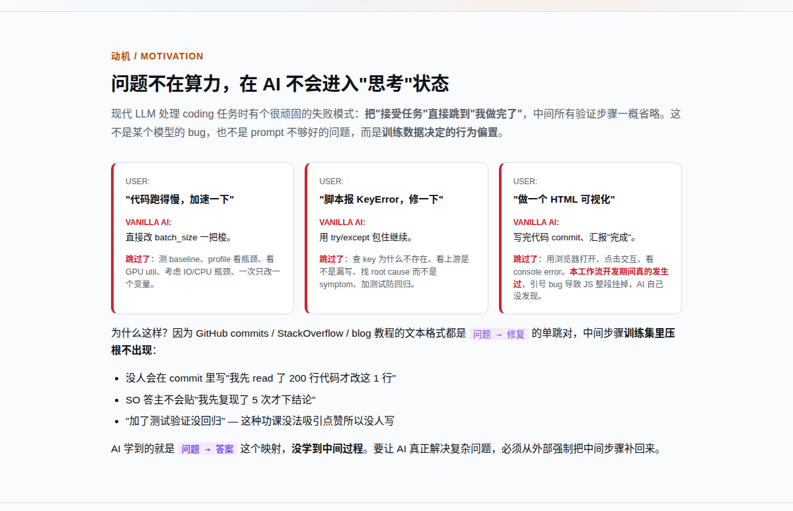
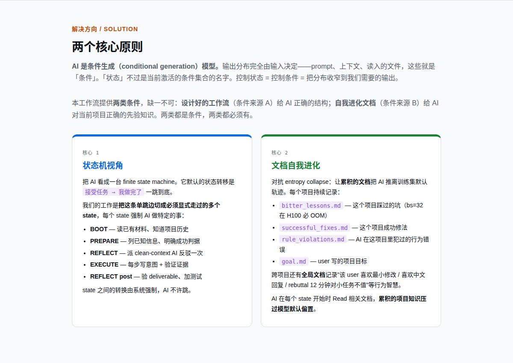
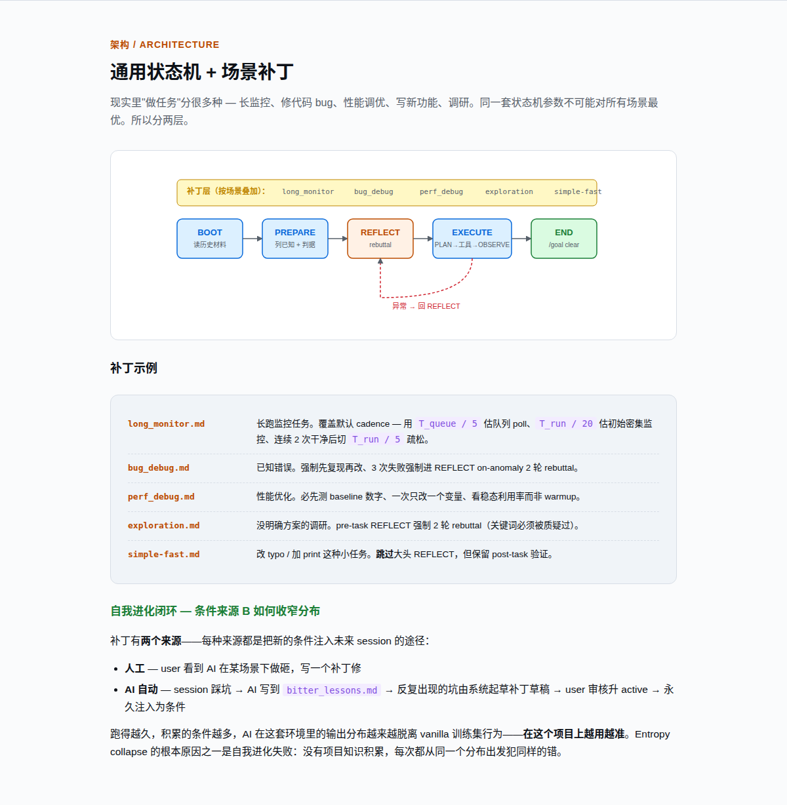
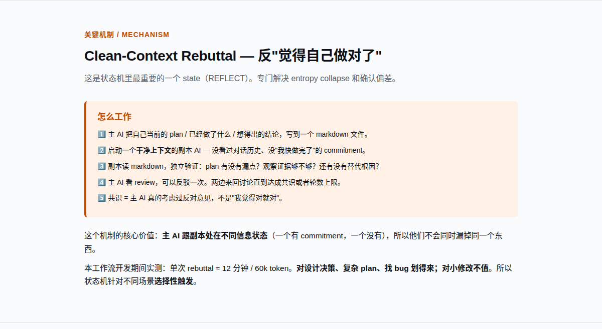

<p align="center">
  
</p>

<h1 align="center">Barry's Workflow — Claude Code 版</h1>

<p align="center">
  一套 hook + 规则文件，把每次 Claude Code 会话约束成一个<br/>
  五状态有限状态机（Finite State Machine, FSM）：<br/>
  BOOT / PREPARE / REFLECT / EXECUTE_LOOP / END。<br/>
  阻止模型跳过中间步骤直接交付「修好后的代码」。
</p>

<p align="center">
  <a href="README.en.md"><b>🇬🇧 English</b></a>
</p>

---

## ⚡ 快速上手

```bash
# 1. 前置
npm install -g @anthropic-ai/claude-code

# 2. 安装本仓库（幂等，可反复跑）
git clone https://github.com/gyy0592/claude-config.git ~/Programs/claude-config
cd ~/Programs/claude-config
bash set_claude.sh

# 3. 正常使用 Claude Code
cd <你的项目>
claude
#    直接告诉它你想做什么——它会自动建 workspace/<任务名>/、写好 goal.md 给你签字。
#    （可选）想手动一次性初始化：
#      bash ~/Programs/claude-config/scripts/new_task.sh <任务名>
#      $EDITOR workspace/<任务名>/goal.md

# 4. 开关
bash ~/Programs/claude-config/scripts/switch_hooks.sh off      # 临时关
bash ~/Programs/claude-config/scripts/switch_hooks.sh on
bash ~/Programs/claude-config/scripts/switch_hooks.sh status
```

详细安装/卸载见 [§6](#6-安装)。下面是设计动机与机制。

---

## 1. 设计动机



LLM 训练数据中绝大多数样本是「问题 → 修好后的代码」的成品对，缺少中间的诊断、试错、复测过程。模型的默认输出分布因此偏向直接产出终态：未跑测试即声明已修、改动范围超出请求、即使多次独立采样输出路径也高度相似（同一条「最像训练集」的轨迹被反复命中）。

仅在 prompt 中追加「请仔细检查」难以扭转此分布——指令本身是低权重的条件，且会随着对话累积被稀释。

<details>
<summary>🧠 entropy collapse 是什么</summary>


</details>

---

## 2. 核心思路：把 AI 视为条件生成器



AI 的输出分布完全由输入条件决定（prompt、上下文文件、工具返回）。所谓「状态」不过是当前激活的条件集合的命名。**控制状态 = 控制条件 = 把分布收窄到我们真正需要的输出。**

本仓库提供两类条件，缺一不可：

| 条件来源 | 内容 | 性质 |
|---|---|---|
| **A. 设计好的工作流** | 五状态 FSM 规则、按状态注入的 **router 文本**（每个状态对应一份 markdown，描述该状态允许/禁止的工具与必须满足的产出，由 hook 拼到用户每轮输入前面）、`[PLAN]` / `[OBSERVE]` 日志纪律、REFLECT 阶段的**反驳协议**（rebuttal，详见 §3） | 静态、人工设计，覆盖训练数据缺失的中间步骤 |
| **B. 自我进化文档** | 项目级 **ledger**（账本式 markdown 文件，逐条编号追加：`bitter_lessons.md` / `successful_fixes.md` / `rule_violations.md`），以及 `content/rules/patches/*.md` 场景补丁 | 动态、随项目积累。每次会话向其中追加条目，下次会话 BOOT 阶段被读入，进一步收窄分布 |

A 给 AI 正确的结构；B 给 AI 关于**这个具体项目**的先验。两者通过 hook 注入到每轮 `UserPromptSubmit` 的上下文中。

---

## 3. 状态机



```
BOOT ──► PREPARE ──► REFLECT ──► EXECUTE_LOOP ──► END
            ▲                          │
            └──────── 异常回退 ─────────┘
```

| 状态 | 允许工具 | 强制产出 | 离开条件 |
|---|---|---|---|
| **BOOT** | Read / Glob / Grep / 只读 Bash | 读完 `~/.claude/rules/` 与 `workspace/<task>/` 下全部 ledger | `transition.sh BOOT_DONE` |
| **PREPARE** | 上述 + 重复 Read（利用 `state.md` 中 `cache_hit_map` 避免重复读） | 写出 `[PLAN]` 待办清单 | `PREPARE_DONE` |
| **REFLECT** | `Agent(run_in_background=true)` | 派出独立子 agent 做 rebuttal | 子 agent 写下 `[CONSENSUS_REACHED]`；默认上限 3 轮，可在 `~/.claude/rules/workflow_config.yaml` 调整 |
| **EXECUTE_LOOP** | 全部 | 每个工具调用前一行 `[PLAN]`、之后一行 `[OBSERVE]` | `EXECUTE_EXIT`；同 loop 内 `execute_loop_audit.sh` 扫描 `action.md` 的异常关键词，3 次反驳则强制回退 REFLECT |
| **END** | Read / 仅向 workspace 写 | 把本次会话提炼的条目追加到 `bitter_lessons.md` / `successful_fixes.md` 等 | session 结束 |

状态切换由模型在满足离开条件后**主动**调用 `bash ~/.claude/hooks/transition.sh <事件名>`。`transition.sh` 本身不是 hook，是模型可调用的脚本；它写入 `state.md`，并在下一轮 `UserPromptSubmit` 时由 `inject_router.sh` 读取新状态、注入对应 router 文本。

**`<task>` 的来源**：用户在 `workspace/<task>/goal.md` 中手动指定；首次 `UserPromptSubmit` 时 `session_boot.sh` 检测 `workspace/` 下最近修改的 task 目录写入 `state.md` 的 `task` 字段。

### REFLECT 的 rebuttal 协议

<details>
<summary>展开</summary>



</details>

主 agent 把当前方案写入 `.barry_workflow/<sid>/reflection_<round>.md`，通过 `Agent` 工具派出子 agent。子 agent 以**全新会话**启动：不传入主 agent 的对话历史，system prompt 由 hook 重新生成（不复用主 agent 的）。子 agent 只读取方案文件、规则文件与代码仓库本身。主 agent 与子 agent 在同一 reflection 文件中追加交替轮次，直到子 agent 写下 `[CONSENSUS_REACHED]`，或达到 `workflow_config.yaml` 中的 `reflect.max_rounds`（默认 3）。

此机制对抗同一上下文内的自我说服偏差——同一会话历史下，模型几乎总会得出「方案没问题」的结论。

---

## 4. 场景补丁

`content/rules/patches/` 下五个补丁针对特定任务类型（如调参、文档迁移、性能审计）覆盖默认状态行为。补丁可手工撰写；也可由用户在 EXECUTE_LOOP 阶段手动跑 `/gen-patch-draft` skill，把 `bitter_lessons.md` 中反复出现的条目起草为补丁草案，人工审核后落到 `patches/`。下次会话 BOOT 阶段被读入，构成「具体踩坑 → 通用约束」的闭环。

补丁不自动激活——避免「AI 自起草约束自己」的失控路径。

---

## 5. 文件结构

```
.barry_workflow/<session_id>/        每会话独立，默认 .gitignore
  state.md           YAML：current_state / stage_history / task / cache_hit_map
  action.md          [PLAN] / [OBSERVE] 逐条日志
  transitions.log    每次状态切换的 3 行摘要
  reflection_*.md    REFLECT 阶段的多轮 rebuttal

workspace/<task>/                    跨会话持久，建议 git track
  goal.md            用户写入，main agent 只读
  bitter_lessons.md  本项目踩过的技术坑（项目内独立编号 L-N）
  successful_fixes.md
  attempts_ledger.md
  rule_violations.md 本项目 AI 行为错误（项目内独立编号 W-N）

~/.claude/rules/                     全局规则（跨项目）
  violation.md       全局 W-XXX（与项目级 rule_violations.md 编号空间相互独立）
  lessons.md         全局 L-XXX（与项目级 bitter_lessons.md 同理）
  router_<STATE>.md  状态注入文
  states/<state>.md  状态完整规约
  patches/*.md       场景补丁
  workflow_config.yaml  可调参数（reflect.max_rounds 等）
```

`bitter_lessons.md`（项目级技术坑）与 `rule_violations.md`（项目级 AI 行为错误）的区别：前者记「这个 batch size 在该卡 OOM」一类技术事实；后者记「漏写 [PLAN] 直接调工具」一类行为错误。两者均以 `tags:` 行索引，新会话 BOOT 阶段按当前任务 grep 召回。

项目级编号（`L-N` / `W-N`）与全局编号（`L-XXX` / `W-XXX`）**命名空间相互独立**，不跨文件交叉引用。

---

## 6. 安装

```bash
npm install -g @anthropic-ai/claude-code   # 前置
git clone https://github.com/gyy0592/claude-config.git ~/Programs/claude-config
cd ~/Programs/claude-config
bash set_claude.sh
```

`set_claude.sh` 的动作：

1. 将 8 个脚本从 `hooks/` 复制到 `~/.claude/hooks/`，sed 替换占位符 `__CLAUDE_CONFIG_DIR__` 为仓库实际路径：
   `inject_router.sh` · `session_boot.sh` · `pretooluse_short_nudge.sh` · `state_enforce.sh` · `transition.sh` · `prepare_helper.sh` · `execute_loop_audit.sh` · `_session_lib.sh`（被其他 hook `source` 的工具库）
2. 同步 `content/rules/` 到 `~/.claude/rules/`
3. 在 `~/.claude/settings.json` 的 `hooks` 字段注册 4 个 hook 回调，分布在 3 种触发点：
   - `UserPromptSubmit` × 2：`session_boot.sh` + `inject_router.sh`
   - `PreToolUse` × 1：`state_enforce.sh`（含 `pretooluse_short_nudge` 子分支）
   - `PostToolUse` × 1：`execute_loop_audit.sh`
4. 对已存在的 `violation.md` / `lessons.md` 做 diff，冲突时交互询问（管道运行默认采用仓库版本）

幂等。升级：`git pull && bash set_claude.sh`。

### 开关与卸载

```bash
bash scripts/switch_hooks.sh off     # 仅移除 settings.json 中的 hooks 注册
bash scripts/switch_hooks.sh on
bash scripts/switch_hooks.sh status
```

完全卸载：

```bash
bash scripts/switch_hooks.sh off
rm ~/.claude/hooks/{inject_router,session_boot,pretooluse_short_nudge,state_enforce,transition,prepare_helper,execute_loop_audit,_session_lib}.sh
rm -rf ~/.claude/rules/{router*.md,states,patches,messages}
rm ~/.claude/rules/{facts_first,dispatch,recording,subagent_rules,failure_stop,fsm,prompt_enhancement,codex_adapter}.md
rm ~/.claude/rules/workflow_config.yaml
```

`violation.md` / `lessons.md` / `~/.claude/skills/` 保留（用户长期资产）。

---

## 7. Skills

`skills/` 下含 30+ 个独立 skill（censor / code-tree / efficiency-audit 等），通过 SKILL.md frontmatter 的 `description` 由 Claude Code 自动召回。与本仓库的 hook 体系正交，可单独安装：

```bash
mkdir -p ~/.claude/skills
for s in ~/Programs/claude-config/skills/*/; do
  ln -sfn "$s" ~/.claude/skills/$(basename "$s")
done
```

清单见 [`docs/skills.md`](docs/skills.md) / [`docs/skills.zh.md`](docs/skills.zh.md)。

---

## 8. Viewer

`viewer/` 是一个本地 HTML 三栏 session 检视器（左：agent 树；右上：state 与 reflection；右下：清洗后的 transcript）。

```bash
bash scripts/start_viewer.sh           # 自动选端口并打印 URL
bash scripts/start_viewer.sh status
bash scripts/start_viewer.sh stop
```

SSH 远端使用：`ssh -L <port>:localhost:<port> user@host`。默认附带一个示例 session（位于 `viewer/data/sample/`）；查看自己的 session 时将数据放入 `viewer/data/<sid>/`。

---

## 9. 参考

| 文档 | 内容 |
|---|---|
| [`docs/skills.md`](docs/skills.md) / [`docs/skills.zh.md`](docs/skills.zh.md) | skill 清单与触发条件 |

`docs/` 下另有若干 HTML 文件（图示版动机说明、典型场景的预期行为），GitHub 不渲染，clone 后本地浏览器打开。

---

<p align="center"><i>由 <a href="https://github.com/gyy0592">@gyy0592</a> 维护。issue 与 PR 欢迎。</i></p>
