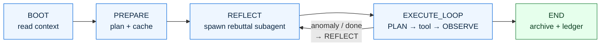

<p align="center">
  
</p>

<h1 align="center">Barry's Workflow — Claude Code Edition</h1>

<p align="center">
  Turn an AI coding agent from a <i>stimulus-response machine</i> into a <i>state machine that reflects on itself</i>.<br/>
  Fight training-distribution bias. Block "feels-done" delusions. Let the docs self-evolve.
</p>

<p align="center">
  <a href="docs/big_picture.html"><b>📖 big_picture</b></a> ·
  <a href="docs/scenarios.html"><b>🎬 scenarios</b></a> ·
  <a href="docs/implementation.html"><b>🔧 implementation</b></a> ·
  <a href="docs/p8_e2e_notes.md"><b>✅ P8 demo report</b></a> ·
  <a href="README.zh.md"><b>🇨🇳 中文</b></a>
</p>

---

## Table of Contents

- [1. Why — skip-to-done](#1-why--skip-to-done)
- [2. Overall idea](#2-overall-idea)
- [3. What it actually does](#3-what-it-actually-does)
- [4. Install](#4-install)
- [5. Daily usage](#5-daily-usage)
- [6. Expected behavior (from P8 demo)](#6-expected-behavior-from-p8-demo)
- [7. Installing my custom skills](#7-installing-my-custom-skills)
- [8. Uninstall / temporarily go vanilla](#8-uninstall--temporarily-go-vanilla)
- [9. Read more](#9-read-more)

---

## 1. Why — skip-to-done


Most LLM training data is "problem + final fixed code" pairs. The **middle** — diagnosis, attempts, retests — is largely missing. So default behavior is **jump to the conclusion**:

- Claims "fixed" without running the test
- Says "OK" without reading console output
- Edits the wrong file / touches a pile of unrelated files and reports "as requested"
- Spin up 10 parallel AIs to compare approaches — all 10 walk the **same** wrong path (entropy collapse)

Just writing "please think carefully" in the prompt doesn't help — the training distribution pulls it back.

<details>
<summary>🧠 what is entropy collapse</summary>


</details>

---

## 2. Overall idea

**AI is conditional generation.** The output distribution is shaped entirely by what we feed in — prompt, context, files. "State" is just a name for the set of active conditions. Controlling state = controlling conditions = steering the distribution toward the outputs we actually need.

Barry's Workflow provides **two types of conditions**, both required:

| Condition source | What it contains | Role |
|---|---|---|
| **A — Designed workflow** | FSM rules, per-state router injections, `[PLAN]/[OBSERVE]` discipline, REFLECT rebuttal protocol | Hard floor. Enforces the intermediate steps that training data never taught. Static, human-designed. |
| **B — Self-evolving docs** | `workspace/<task>/bitter_lessons.md`, `successful_fixes.md`, `rule_violations.md`, `patches/*.md` | Narrows the distribution further every session. Each accumulated lesson pushes the AI away from training-set defaults toward what worked in *this* codebase. Grows over time. |

Neither source alone is sufficient. The workflow gives the AI the right structure; the self-evolving docs give it the right priors for *this* project.

**The self-evolution loop** (condition source B):

```
session hits an unexpected pitfall
  → AI records it in workspace/<task>/bitter_lessons.md (L-N entry + tags)
  → next session: AI reads bitter_lessons.md in BOOT → distribution narrowed
  → if pattern recurs: AI (or user) drafts a patch under content/rules/patches/
  → patch is promoted to active → injected as a condition in future sessions
  → distribution narrowed further, permanently
```

Entropy collapse is partly a self-evolution failure: when no project-specific knowledge accumulates, every session starts from the same vanilla distribution and makes the same mistakes.

Plus one mechanism against **"feels-done" delusion**:

<details open>
<summary><b>Clean-Context Rebuttal — spawn a fresh AI as reviewer</b></summary>


</details>

---

## 3. What it actually does

A session is one FSM run. Every state transition calls `hooks/transition.sh`. Each turn injects the current state's router, telling the AI **what's allowed, what's not, how to advance**.

### FSM



### Generic FSM + scenario patches


The 5 scenario patches under `content/rules/patches/` override defaults for specific task types. They can be **written by hand** OR **auto-drafted by AI** from recurring entries in `bitter_lessons.md` — this is the self-evolution loop.

### What a session leaves behind

```
.barry_workflow/<sid>/
├── state.md              YAML: current state + history + cache_hit_map
├── action.md             append-only [PLAN] / [OBSERVE] log
├── transitions.log       3-line summary per state change (FSM timeline)
└── reflection_*.md       REFLECT round files

workspace/<task>/         (long-lived, git tracked)
├── goal.md               user writes, main reads only
├── bitter_lessons.md     L-N + tags: project gotchas
├── successful_fixes.md   FIX-N + tags: confirmed fixes
├── attempts_ledger.md    ATT-N + tags: what was tried (cross-turn intent log)
└── rule_violations.md    W-N + tags: project-level AI behavioral mistakes
```

---

## 4. Install

### Prerequisites

```bash
npm install -g @anthropic-ai/claude-code
```

### Deploy

```bash
git clone https://github.com/gyy0592/claude-config.git ~/Programs/claude-config
cd ~/Programs/claude-config
bash set_claude.sh
```

`set_claude.sh` will:

1. Copy 8 hooks into `~/.claude/hooks/`, sed-substituting `__CLAUDE_CONFIG_DIR__` to the actual repo path
2. Sync rule files into `~/.claude/rules/` (router / states / patches / messages — all of them)
3. Register 4 hooks in `~/.claude/settings.json` (UserPromptSubmit / PreToolUse / PostToolUse)
4. Diff any existing `~/.claude/rules/violation.md + lessons.md` against the repo version; on conflict, ask which to keep (auto-prefers repo in non-interactive mode)

### Upgrade / re-deploy

```bash
cd ~/Programs/claude-config && git pull && bash set_claude.sh
```

Idempotent — safe to re-run.

### Migrating from the old v1 (cosplay rules)

```bash
bash cleanup_v1.sh          # remove old hooks + ~/.claude_status/ runtime cruft
bash set_claude.sh          # then deploy v2
```

---

## 5. Daily usage

### Entering a project

On the first `claude` invocation in a repo, the session_boot hook auto-creates:

```
.barry_workflow/<session-id>/{state,action,transitions.log}
```

Only fires if the cwd has `.git` / `CLAUDE.md` / `workspace/` (anti-pollution).

### Long-running task → workspace ledgers

For a longer project (training-pipeline tuning, paper reproduction, etc.):

```bash
mkdir -p workspace/<task_name>
echo "<your goal>" > workspace/<task_name>/goal.md
```

`goal.md` is user-controlled; main reads only. Other ledgers (`bitter_lessons / successful_fixes / attempts_ledger / rule_violations`) grow as the AI works.

### Temporarily go vanilla

For a trivial one-shot where you don't want the FSM overhead:

```bash
bash scripts/switch_hooks.sh off       # un-register the 4 hooks
bash scripts/switch_hooks.sh on        # add them back
bash scripts/switch_hooks.sh status    # show what's currently registered
```

Only touches the hooks section of `~/.claude/settings.json`. Rule files, hook script files, and the bg-bash logger hook are untouched.

### See what the AI did this turn

```bash
# Clean transcript (user msg + AI text + tool calls + results)
python3 scripts/extract_transcript.py \
  ~/.claude/projects/<encoded-cwd>/<sid>.jsonl \
  --tool-result-lines 5 --no-system-reminder

# FSM timeline (3 lines per state change: ts + transition + tool count + last AI sentence)
cat .barry_workflow/<sid>/transitions.log
```

### Browse a session in your browser (viewer)

`viewer/` is a 3-pane local HTML inspector (agent tree / state + reflections / clean transcript). One-button launch:

```bash
bash scripts/start_viewer.sh          # auto-pick free port, print URL
bash scripts/start_viewer.sh status   # show pid + URL
bash scripts/start_viewer.sh stop     # kill it
```

If you're SSH'd into the host, set up port forwarding from your laptop first:  
`ssh -L <port>:localhost:<port> user@host` — then open the printed URL in your laptop browser.

The default sample session is the P8 demo (cloud claude migrating a real repo). Drop your own session data into `viewer/data/<sid>/` to inspect any session.

---

## 6. Expected behavior (from P8 demo)

The **P8 e2e demo** ran on 2026-05-14. A fresh cloud claude (with the v2 hooks deployed) was given a real migration task: integrate `~/github_repo/LLM_sampling_implement` into the v2 ledger system.

**All 4 core checks PASSED**:

| Check | Result | Evidence |
|---|:--:|---|
| Full 5-stage FSM walk | ✅ | `stage_history` 5 entries: BOOT_DONE → PREPARE_DONE → REFLECT_DONE(pre) → EXECUTE_EXIT → REFLECT_DONE(post) |
| Router injection by state | ✅ | Multiple `[ROUTER · state=X]` in transcript |
| Subagent dispatch works | ✅ | 2× `Agent(run_in_background=true)`: REFLECT rebuttal + EXECUTE ledger-build |
| session_boot auto-creates files | ✅ | First UserPromptSubmit produced `.barry_workflow/<sid>/{state,action}.md` |

**Deliverables**: 5 ledgers (with L-N / W-N / FIX-N / ATT-N + tags), legacy archive directory, 5 [PLAN]/[OBSERVE] pairs in action.md.

**Actual cost**: 18 min wall-clock, ~250K tokens (includes 2 subagents).

Full walkthrough + 4 issues found → [`docs/p8_e2e_notes.md`](docs/p8_e2e_notes.md).

---

## 7. Installing my custom skills

`skills/` contains 30+ reusable skills (censor audit, code-tree map, efficiency-audit, etc.). Install by symlinking into `~/.claude/skills/`:

```bash
mkdir -p ~/.claude/skills
for s in ~/Programs/claude-config/skills/*/; do
  name=$(basename "$s")
  ln -sfn "$s" ~/.claude/skills/"$name"
done
```

Or cherry-pick:

```bash
ln -sfn ~/Programs/claude-config/skills/censor          ~/.claude/skills/censor
ln -sfn ~/Programs/claude-config/skills/code-tree       ~/.claude/skills/code-tree
ln -sfn ~/Programs/claude-config/skills/efficiency-audit ~/.claude/skills/efficiency-audit
```

Trigger logic for each skill lives in its `SKILL.md` frontmatter `description` field — Claude invokes it automatically when context matches.

Full list → [`docs/skills.md`](docs/skills.md) (EN) / [`docs/skills.zh.md`](docs/skills.zh.md) (中文).

---

## 8. Uninstall / temporarily go vanilla

**Temporary off** (keep all files, just stop firing hooks):

```bash
bash scripts/switch_hooks.sh off
```

**Full uninstall**:

```bash
bash scripts/switch_hooks.sh off
rm -rf ~/.claude/hooks/{inject_router,session_boot,pretooluse_short_nudge,state_enforce,transition,prepare_helper,execute_loop_audit,_session_lib}.sh
rm -rf ~/.claude/rules/{router*.md,states,patches,messages,facts_first.md,dispatch.md,recording.md,subagent_rules.md,failure_stop.md,fsm.md,prompt_enhancement.md,codex_adapter.md,workflow_config.yaml}
# Keep user content:
#   ~/.claude/rules/violation.md   ← cross-project W-XXX
#   ~/.claude/rules/lessons.md     ← cross-project L-XXX
```

Won't touch `~/.claude/skills/` (those symlinks are installed separately).

---

## 9. Read more

| Doc | Audience | Content |
|---|---|---|
| [`docs/big_picture.html`](docs/big_picture.html) | Non-engineers / first-time readers | Motivation + entropy collapse + two core principles + design philosophy |
| [`docs/scenarios.html`](docs/scenarios.html) | "What's the ideal behavior?" | 5 scenarios with state-by-state expected behavior + common pitfalls |
| [`docs/implementation.html`](docs/implementation.html) | Engineers / forkers | Every file, why it exists, whether it's actually been tested |
| [`docs/problem_discussion.md`](docs/problem_discussion.md) | Evolution junkies | Design discussions that shaped the current form |
| [`docs/p8_e2e_notes.md`](docs/p8_e2e_notes.md) | "Does it actually work?" | P8 demo full walkthrough + 4 findings |
| [`docs/pros_cons.md`](docs/pros_cons.md) | Pre-adoption decision | What this is NOT good for |

---

<p align="center"><i>Maintained by <a href="https://github.com/gyy0592">@gyy0592</a>. Bug reports / improvement ideas welcome via issues.</i></p>
